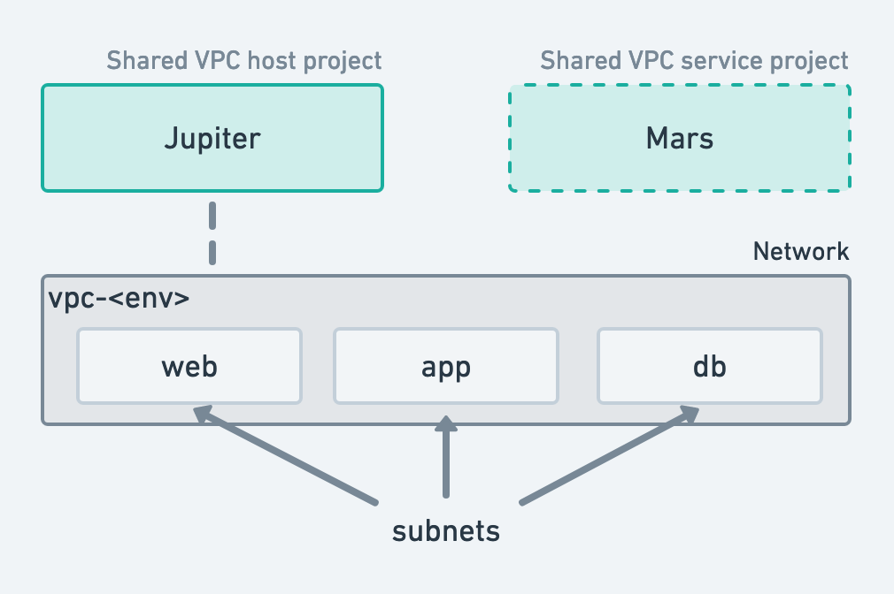

# Terraform - GCP - Excercise

### Directory Structure

Create a git repository and intialize a directory structure suitable for
following resource layout.

### Create resources in following scenario using Terraform

1. There are two projects `Jupiter` and `Mars` (You are free to choose any
   name as long as it follows GCP best practices. Jupiter and Mars are just for
   reference). `Mars` Project is only needed in Challenge section.
2. You should plan to have a `qa` and a `prod` environments (`<env>` in
   diagram).  Assume that the resources are mostly identical. 
3. Create the Virtual Private Cloud (VPC) Network and Subnets.
4. Create a bastion server under Jupiter project, on `web` subnet. Use default
   OS for the VM.
5. Create another VM under `Jupiter` project on app subnet named `rocket-app`.
   This VM should NOT have a pulic IP.
6. Create appropriate firewall rules so that user can access `rocket-app` from
   Bastion server using SSH. The port 80 of `rocket-app` should be accessible
   too.
7. Assume `rocket-app` VM needs internet access. Since we didn't give it
   a public IP, next option is to allow access via [Cloud
   NAT](https://cloud.google.com/nat/). Configure cloud NAT for your netwrok.
8. When you are working in a team environment, managing and collaborating on
   code is a problem. Git solves this for us. With Terraform, the state also
   becomes a problem. Remote state solves this problem. Configure remote state
   for your project.

**Challenge:**

1. Configure it so that resources from each project can use the same network
   resources 1.
2. Create a Google Kubernetes Engine (GKE) cluster in Mars Project. Use `app`
   subnet as the primary subnet for cluster.

!!! info
    1This can not be done without Organization level permissions. To
    set up an organization you need either
    [Gsuite](https://gsuite.google.com.sg/intl/en_sg/) or [Cloud
    Identity](https://cloud.google.com/identity/). Premium tier costs $6/month.
    Cloud identity has a [free
    tier]()https://cloud.google.com/identity/docs/set-up-cloud-identity-admin#sign-up-for-cloud-identity-free.
    Use that to set up an organization. You would also need your own **domain
    name**.
